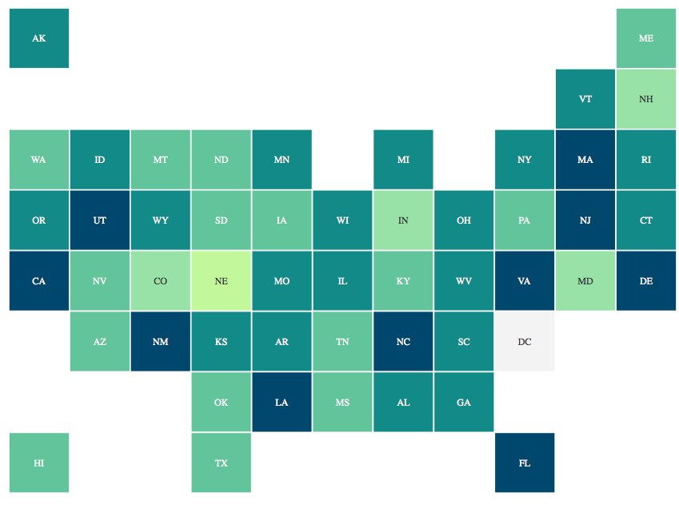
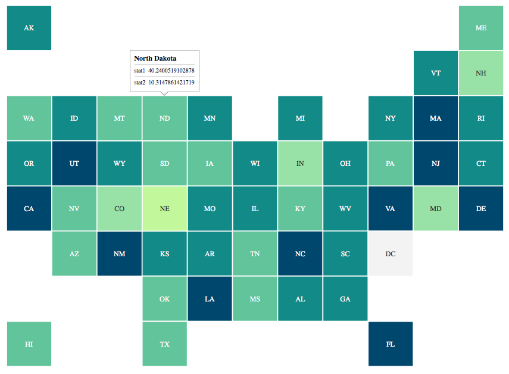

<p align="center">
  
</p>

An R interface for squaire.js, a Javascript library to create responsive equal-area square maps using d3. Default layout is U.S. map but custom layout abilities are being implemented.  

See [https://github.com/WSJ/squaire](https://github.com/WSJ/squaire) for the javascript library.

### To do

- Static tooltip shiny test
- Implement custom layouts
- Add more d3 colorscales functionality

### Installation

```
devtools::install_github('jkassof/rsquaire')
```

### About

Squaire.js is a javascript library that lets you make very rich equal-area square maps. `rsquaire` is an `htmlwidgets` based R wrapper for that library. Only the default U.S. state map layout is available but custom layouts are coming soon. You pass `rsquaire` a dataframe and tell it which variable you want to color your map by

#### Input

`rsquaire` accepts a dataframe in "wide format." There should be a state column, and a column for each variable you want to include in the graphic. These variables can be displayed through coloring or on a tooltip.

```
wide_data <- tibble::tibble(
state = state.abb,
stat1 = rnorm(50, 50, 15),
stat2 = rnorm(50, 15. 3)
)

```


### Use


Pass the `rsquaire` function your dataframe, and indicate which column you want to base the coloring on with the `index` arguement.

```
rsquaire(wide_data, index = "stat1")
```



<br><br>

While you can only color squares by one variable, you can include the other variables from your input data with tooltips. Use the `tooltip` arguement to enable them.

```
rsquaire(wide_data, index = "stat1", tooltip = TRUE)
```




Check out `?rsquaire` for all arguements.

### Attribution

The squaire.js library was created by [Wall Street Journal's Graphics Team](https://github.com/WSJ)

